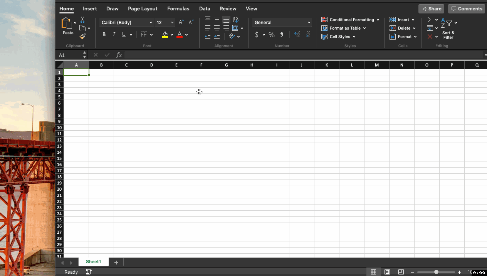
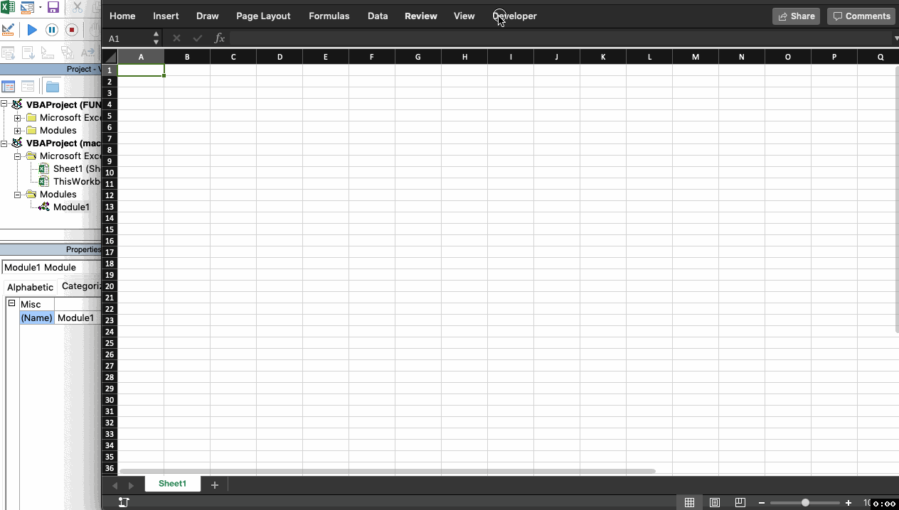
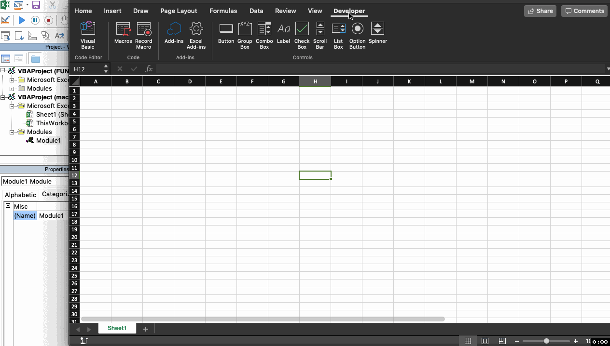
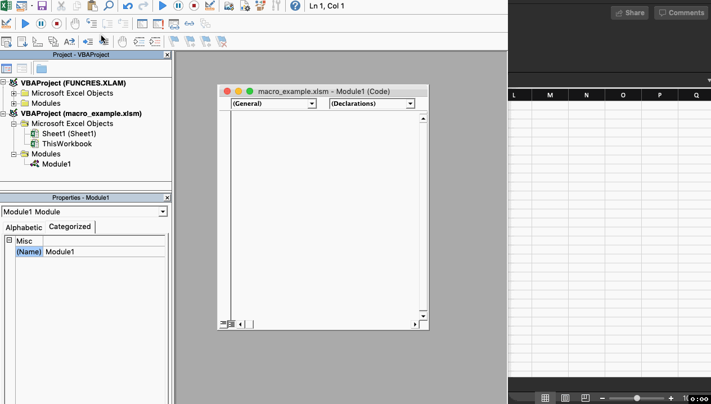

### Very VBA ###

The following **concepts** has been coverd in this class:

* [x] VBA basics
	* [-] variables
		* [-] variable declaration
		```
		dim ing1 as String
		dim ing2 as String
		dim budget as Double
		```
		* [-] variable Assignment
		```
		ing1 = "Peanut Butter"
		ing2 = "Jelly"
		budget = 5.00
		```
	* [-] arrays
		* [-] group of items together
		```
		Dim ingredients(0 to 2) As String
		ingredients(0) = "Peanut Butter"
		ingredients(1) = "Jelly"
		ingredients(2) = "Bread"
		```
	* [-] conditions
		* [-] If This... Then That.
		```
		If pbThicknes > 1.0 Then
			stopSpreading()
		Else
			startSpreading()
		```
	* [-] Iteration
		* [-] For loop
		```
		For i = 0 To 20
			stopSpreading()
		Next i
		```
	* [-] Functions and Sub
		* [-] The difference between a function and a sub in Excel VBA is that a function can return a value while a sub cannot.
		```
		Function Area(x As Double, y As Double) As Double
			Area = x * y
		End Function
		Sub Area(x As Double, y As Double)
			MsgBox x * y
		End Sub
		```
* [x] Excercise
	* [-] Hello world program
	```
	Sub Helloworld():
    	MsgBox ("HelloWorld1")
	End Sub
	```
	* [-] Hello world program
	```
	Sub Helloworld():
    	MsgBox ("HelloWorld1")
	End Sub
	```

## Video Walkthrough of concepts:

Here's a walkthrough of implemented basic cases:

1. Hello World


2. Button Click


3. Cells function


4. Range function


5. Variables


6. Arrays


7. Split function


GIF created with [LiceCap](http://www.cockos.com/licecap/).
