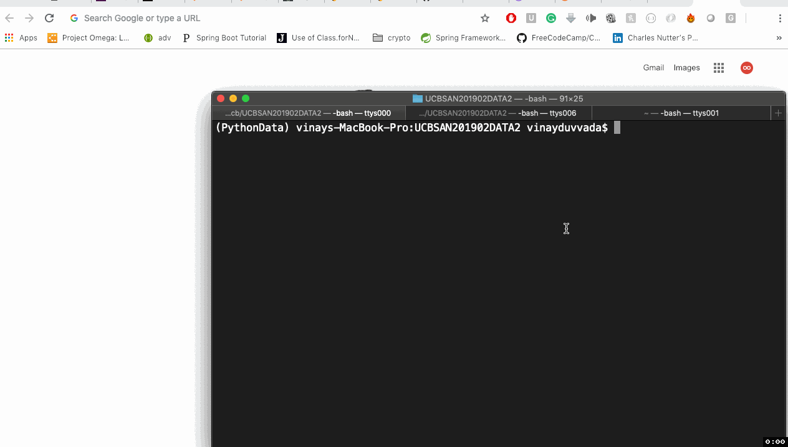

### Introduction to Pandas ###

The following **concepts** has been coverd in this class:
* Mar-02-2019

* [x] Pandas basics - basic introduction
    * [-] How to run jupyter 
        ```
        # Go to folder
        $ cd UCBSAN201902DATA2/

        # run jupyter notebook to run local server
        $ jupyter notebook
        ```
    * [-] How to access jupyter notbook server
        ```
        # Open browser and goto local host
        Step 1 : open google chrome
        Step 1 : http://localhost:8888/
        ```
    * [-] How to run pandas in jupyter notbook
        ```
        # activate anaconda env using command promopt
        $ source activate PythonData

        # run jupyter notebook to run local server
        $ jupyter notebook

        # Open browser and goto local host
        Step 1 : http://localhost:8888/
        
        # Create a new python Notebook
        - click New and select python 3
        
        ```
        
## Video Walkthrough of concepts:
    * [-] How to run pandas in jupyter notbook 
    
 
* [x] Excercise
  * [-] 
