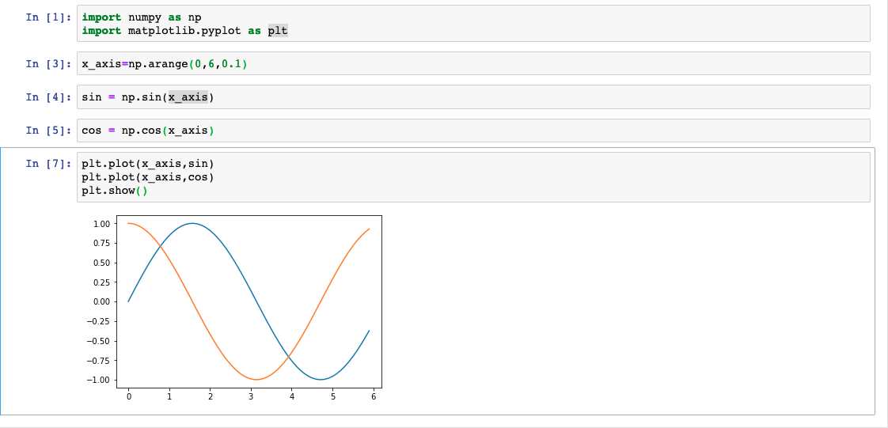
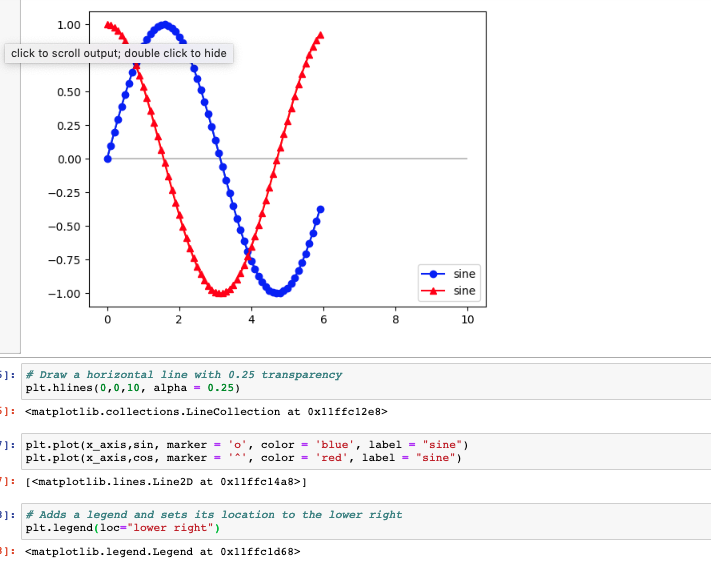
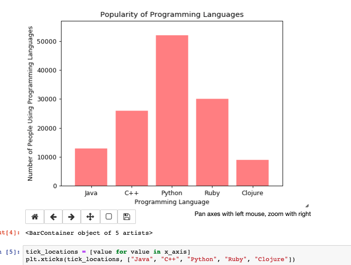
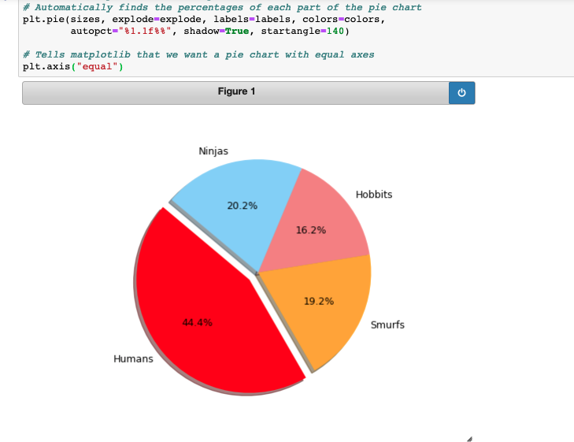
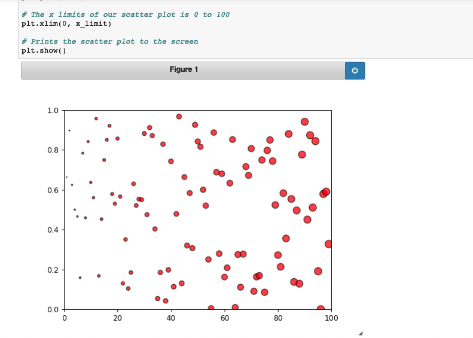

### Intro to Graphing with Matplotlib ###

The following **concepts** has been coverd in this class:
* March-09-2019

##### Day 1 Objectives
##### ---
##### - Understand Matplotlib's pyplot interface.
##### - Be able to create line; bar; scatter; and pie charts.
##### - Be familiar with basic plot configuration options, such as xlim and ylim.

* [x] Jupyter coding - Data handling
    * [-] How to run pandas in jupyter notbook
        ```
        # Go to folder
        $ cd UCBSAN201902DATA2/

        # activate anaconda env using command promopt
        $ source activate PythonData

        # run jupyter notebook to run local server
        $ jupyter notebook

        # Open browser and goto local host
        Step 1 : http://localhost:8888/
        
        # Create a new python Notebook
        - click New and select python 3
        
        ```

    * [-] How to plot a graph using matplotlib and numpy
        - How to plot a BASIC LINE GRAPH: SIN COS CHART
        ```
        # Import Numpy for calculations and matplotlib for charting
        import numpy as np
        import matplotlib.pyplot as plt

        # Create our x_axis list
        x_axis = np.arange(0, 6, 0.1)

        # Creates a list based on the sin of our x_axis values
        sin = np.sin(x_axis)

        # Creates a list based on the cos of our x_axis values
        cos = np.cos(x_axis)

        # Plot both of these lines so that they will appear on our final chart
        plt.plot(x_axis, sin)
        plt.plot(x_axis, cos)

        plt.show()
        ```

        ### Chart image ###
        

    * [-] Note: Please add `%numplotlib notebook` at starting line of program
    
    * [-] How to plot a graph using customized line graph
        - How to plot a BASIC LINE GRAPH With configuration
        ```
        # need to specify the below line to allow dynamic/interactive figure object
        %matplotlib notebook

        # Dependencies
        import matplotlib.pyplot as plt
        import numpy as np

        # Set x axis and variables
        x_axis = np.arange(0, 10, 0.1)
        sin = np.sin(x_axis)
        cos = np.cos(x_axis)

        # Draw a horizontal line with 0.25 transparency
        plt.hlines(0, 0, 10, alpha=0.25)

        # Give our graph axis labels
        plt.xlabel("X-axis")
        plt.ylabel("Y-axis")

        # Each point on the sine chart is marked by a blue circle
        sine_handle, = plt.plot(x_axis, sin, marker ='o', color='blue', label="Sine")
        # Each point on the cosine chart is marked by a red triangle
        cosine_handle, = plt.plot(x_axis, cos, marker='^', color='red', label="Cosine")

        # Adds a legend and sets its location to the lower right
        plt.legend(loc="lower right")

        # Saves an image of our chart so that we can view it in a folder
        plt.savefig("../Images/lineConfig.png")
        plt.show()
        ```
        ### Chart image ###
        
    * [-] How to plot a graph using customized line graph with more options
        ```
        %matplotlib notebook

        # Dependencies
        import matplotlib.pyplot as plt
        import numpy as np

        # Generate the x values from 0 to 10 using a step of 0.1
        x_axis = np.arange(0, 10, 0.1)
        sin = np.sin(x_axis)
        cos = np.cos(x_axis)

        # Add a semi-transparent horizontal line at y = 0
        plt.hlines(0, 0, 10, alpha=0.25)

        # Use dots or other markers for your plots, and change their colors
        plt.plot(x_axis, sin, linewidth=0, marker="o", color="blue")
        plt.plot(x_axis, cos, linewidth=0, marker="^", color="red")

        # Add labels to the x and y axes
        plt.title("Juxtaposed Sine and Cosine Curves")
        plt.xlabel("Input (Sampled Real Numbers from 0 to 10)")
        plt.ylabel("Value of Sine (blue) and Cosine (red)")

        # Set your x and y limits
        plt.xlim(0, 10)
        plt.ylim(-1, 1)

        # Set a grid on the plot
        plt.grid()

        # Save the plot and display it
        plt.savefig("../Images/sin_cos_with_markers.png")
        plt.show()
        ```
     * [-] How to plot a BAR GRAPH
        ```
        %matplotlib notebook

        import matplotlib.pyplot as plt
        import numpy as np

        # Create an array that contains the number of users each language has
        users = [13000, 26000, 52000, 30000, 9000]
        x_axis = np.arange(len(users))

        # Tell matplotlib that we will be making a bar chart
        # Users is our y axis and x_axis is, of course, our x axis
        # We apply align="edge" to ensure our bars line up with our tick marks
        plt.bar(x_axis, users, color='r', alpha=0.5, align="center")

        # Tell matplotlib where we would like to place each of our x axis headers
        tick_locations = [value for value in x_axis]
        plt.xticks(tick_locations, ["Java", "C++", "Python", "Ruby", "Clojure"])

        # Sets the x limits of the current chart
        plt.xlim(-0.75, len(x_axis)-0.25)

        # Sets the y limits of the current chart
        plt.ylim(0, max(users)+5000)

        # Give our chart some labels and a tile
        plt.title("Popularity of Programming Languages")
        plt.xlabel("Programming Language")
        plt.ylabel("Number of People Using Programming Languages")
        ```
        ### Bar Chart image ###
        

    * [-] How to plot a PIE CHART
        ```
        %matplotlib notebook

        # Import our dependencies
        import matplotlib.pyplot as plt
        import numpy as np

        # Labels for the sections of our pie chart
        labels = ["Humans", "Smurfs", "Hobbits", "Ninjas"]
        ​
        # The values of each section of the pie chart
        sizes = [220, 95, 80, 100]
        ​
        # The colors of each section of the pie chart
        colors = ["red", "orange", "lightcoral", "lightskyblue"]
        ​
        # Tells matplotlib to seperate the "Python" section from the others
        explode = (0.1, 0, 0, 0)

        # Creates the pie chart based upon the values above
        # Automatically finds the percentages of each part of the pie chart
        plt.pie(sizes, explode=explode, labels=labels, colors=colors,
                autopct="%1.1f%%", shadow=True, startangle=140)

        # Tells matplotlib that we want a pie chart with equal axes
        plt.axis("equal")
        ```
        ### PIE Chart image ###
        

    * [-] How to plot a SCATTER PLOTS
        ```
        %matplotlib notebook

        # Import Dependencies
        import random
        import matplotlib.pyplot as plt
        import numpy as np

        # The maximum x value for our chart will be 100
        x_limit = 100

        # List of values from 0 to 100 each value being 1 greater than the last
        x_axis = np.arange(0, x_limit, 1)

        # Create a random array of data that we will use for our y values
        data = [random.random() for value in x_axis]

        # Tells matplotlib that we want to make a scatter plot
        # The size of each point on our plot is determined by their x value
        plt.scatter(x_axis, data, marker="o", facecolors="red", edgecolors="black",
                    s=x_axis, alpha=0.75)

        # The y limits of our scatter plot is 0 to 1
        plt.ylim(0, 1)

        # The x limits of our scatter plot is 0 to 100
        plt.xlim(0, x_limit)

        # Prints the scatter plot to the screen
        plt.show()
        ```
        ### SCATTER Chart image ###
        

* [x] Excercise
  * [-] NJ Temp
  
* [x] Ref
    * [-] 
    * [-] 